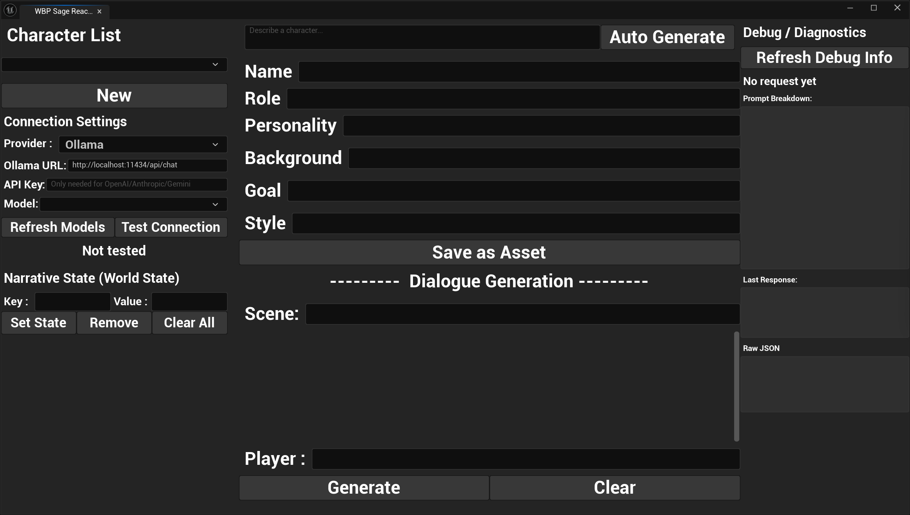

# SageReactor — UE5 LLM-Powered Narrative Prototyping Tool

## Project Plan & Technical Specification

---

## 1. 项目定位

### 1.1 一句话描述
一个UE5编辑器内的AI叙事工具，连接本地Ollama LLM，帮助游戏叙事设计师快速生成、迭代和预览NPC角色对话。

### 1.2 目标岗位：Embark Studios — Gameplay Engineer (LLMs, Creator Tools & Narrative Systems)

### 1.3 Demo想要证明的三件事
1. **学习能力**：能快速上手UE5 + C++并交付可用工具
2. **岗位理解**：理解"creator-facing AI工具"的核心需求——可控性、可调试、服务于创作者
3. **交叉能力**：AI工程 × 游戏引擎集成，这是你区别于传统gameplay工程师的独特价值

---

## 2. 技术架构

```
┌──────────────────────────────────────────────────────┐
│                    UE5 Editor                          │
│                                                        │
│  ┌────────────────────────────────────────┐            │
│  │     SageReactor Editor Panel        │            │
│  │     (Editor Utility Widget / UMG)      │            │
│  │                                        │            │
│  │  ┌──────────┐  ┌───────────────────┐  │            │
│  │  │ Character │  │ Dialogue          │  │            │
│  │  │ Editor    │  │ Generation View   │  │            │
│  │  └──────────┘  └───────────────────┘  │            │
│  │  ┌──────────────────────────────────┐  │            │
│  │  │ Debug / Diagnostics Tab          │  │            │
│  │  └──────────────────────────────────┘  │            │
│  └───────────────┬────────────────────────┘            │
│                  │ BlueprintCallable                    │
│  ┌───────────────▼────────────────────────┐            │
│  │  LLMServiceSubsystem (C++)             │            │
│  │  - Async HTTP to Ollama                │            │
│  │  - Prompt construction                 │            │
│  │  - Response parsing & validation       │            │
│  │  - Request queue & error handling      │            │
│  └───────────────┬────────────────────────┘            │
│                  │                                      │
│  ┌───────────────▼────────────────────────┐            │
│  │  Narrative Data Layer (C++)            │            │
│  │  - UCharacterProfile (UDataAsset)      │            │
│  │  - FDialogueEntry / UDialogueSession   │            │
│  │  - NarrativeState (world state store)  │            │
│  │  - ResponseValidator (quality gate)    │            │
│  └───────────────┬────────────────────────┘            │
│                  │                                      │
│  ┌───────────────▼────────────────────────┐            │
│  │  Gameplay Preview (C++ + Blueprint)    │            │
│  │  - NarrativeNPCComponent               │            │
│  │  - Dialogue trigger (collision)        │            │
│  │  - In-game dialogue UI widget          │            │
│  └────────────────────────────────────────┘            │
└──────────────────┬─────────────────────────────────────┘
                   │ HTTP POST (localhost:11434)
┌──────────────────▼─────────────────────────────────────┐
│  Ollama (local)                                         │
│  Model: qwen3.5:9b (or qwen2.5:7b as fallback)        │
│  Endpoint: POST /api/chat                               │
└─────────────────────────────────────────────────────────┘
```

### 2.1 UE5版本选择
- 推荐 **UE 5.4** (稳定版)
- UE 5.5也可以，但5.4的教程和社区资源更多

### 2.2 项目类型
- C++ 空白项目（Blank template）
- 项目名称：`SageReactor`

### 2.3 关键UE模块依赖
- `HTTP` — HTTP请求
- `Json` / `JsonUtilities` — JSON序列化/反序列化
- `UMG` — UI框架
- `EditorSubsystem` — 编辑器子系统（如果用Subsystem架构）

---

## 3. C++ 模块设计

### 3.1 Module: LLMService

**LLMTypes.h** — 数据结构定义
```cpp
// 核心数据结构，所有模块共用

USTRUCT(BlueprintType)
struct FLLMRequest
{
    GENERATED_BODY()

    UPROPERTY(BlueprintReadWrite)
    FString Model;  // e.g. "qwen3.5:9b"

    UPROPERTY(BlueprintReadWrite)
    FString SystemPrompt;

    UPROPERTY(BlueprintReadWrite)
    TArray<FString> MessageHistory;  // 交替的user/assistant消息

    UPROPERTY(BlueprintReadWrite)
    FString UserMessage;

    UPROPERTY(BlueprintReadWrite)
    float Temperature = 0.7f;
};

USTRUCT(BlueprintType)
struct FLLMResponse
{
    GENERATED_BODY()

    UPROPERTY(BlueprintReadWrite)
    bool bSuccess;

    UPROPERTY(BlueprintReadWrite)
    FString Content;

    UPROPERTY(BlueprintReadWrite)
    FString RawJSON;  // 调试用

    UPROPERTY(BlueprintReadWrite)
    float ResponseTimeMs;

    UPROPERTY(BlueprintReadWrite)
    FString ErrorMessage;
};
```

**LLMServiceSubsystem.h/.cpp** — 核心服务
```
职责：
- 管理Ollama连接配置（URL, model name, 可在编辑器面板中配置）
- 异步发送HTTP POST到 Ollama /api/chat
- 解析JSON响应
- 提供BlueprintCallable接口给Editor Widget调用
- 请求队列（避免并发请求冲突）
- 错误处理和超时

关键函数：
- SendChatRequest(FLLMRequest, OnComplete delegate)
- CancelCurrentRequest()
- IsRequestInProgress()
- GetLastResponse() — 调试用

注意：
- 使用 FHttpModule::Get().CreateRequest()
- 异步回调用 FHttpRequestCompleteDelegate
- Ollama /api/chat 默认返回流式响应，需要设置 "stream": false
- 设置合理的超时时间（30秒），9B模型在RTX4080上响应通常<5秒
```

**PromptBuilder.h/.cpp** — Prompt工程
```
职责：
- 根据CharacterProfile构建system prompt
- 管理prompt模板
- 注入场景上下文
- 控制输出格式和约束

System Prompt模板示例：
"""
You are a narrative designer's assistant generating in-character dialogue.

CHARACTER PROFILE:
- Name: {Name}
- Role: {Role}
- Personality: {Personality}
- Background: {Background}
- Current Goal: {Goal}
- Speaking Style: {SpeakingStyle}

SCENE CONTEXT:
{SceneContext}

WORLD STATE:
{NarrativeState}

EXAMPLE DIALOGUE (match this tone and style):
{ExampleDialogues}

RULES:
- Stay strictly in character
- Keep responses to 1-3 sentences unless asked for more
- Match the speaking style defined above
- Do not break character or reference being an AI
- If the player says something unrelated, deflect naturally in character
- Adjust your behavior based on the world state above

Respond to the player's dialogue as {Name}.
"""

关键设计原则：
- Prompt模板应可配置，不要硬编码
- 角色约束放在system prompt中，用户输入放在user message中
- NarrativeState注入世界状态，让NPC根据游戏状态改变行为
- ExampleDialogues提供few-shot样本，比纯描述更有效地控制语气
- 这体现了JD要求的"controllable AI" — 设计师通过编辑角色参数来控制AI输出
```

### 3.2 Module: NarrativeData

**CharacterProfile.h/.cpp**
```
UCharacterProfile : public UDataAsset

UPROPERTY(EditAnywhere, BlueprintReadWrite, Category="Identity")
FString CharacterName;

UPROPERTY(EditAnywhere, BlueprintReadWrite, Category="Identity")
FString Role;  // e.g. "Village blacksmith", "Mysterious traveler"

UPROPERTY(EditAnywhere, BlueprintReadWrite, Category="Personality")
FString Personality;  // e.g. "Gruff but kind, speaks in short sentences"

UPROPERTY(EditAnywhere, BlueprintReadWrite, Category="Background")
FText Background;  // 用FText支持多行

UPROPERTY(EditAnywhere, BlueprintReadWrite, Category="Behavior")
FString CurrentGoal;  // e.g. "Convince the player to retrieve the lost sword"

UPROPERTY(EditAnywhere, BlueprintReadWrite, Category="Behavior")
FString SpeakingStyle;  // e.g. "Medieval formal, uses 'thee' and 'thou'"

UPROPERTY(EditAnywhere, BlueprintReadWrite, Category="Few-Shot")
TArray<FString> ExampleDialogues;  // 角色对话样本，注入Prompt让LLM模仿语气

使用UDataAsset的原因：
- 可以在Content Browser中创建、保存、复用
- 支持编辑器面板中的属性编辑器
- 这体现了JD要求的"content workflows" — 角色数据作为资产管理
```

**NarrativeState.h/.cpp** — 世界状态系统
```
核心思想：从 stateless chatbot → stateful narrative system

USTRUCT(BlueprintType)
struct FNarrativeState
{
    UPROPERTY(EditAnywhere, BlueprintReadWrite)
    TMap<FString, FString> StateMap;
    // 例如:
    // "player_reputation" → "criminal"
    // "quest_stage" → "after_king_death"
    // "npc_attitude" → "hostile"
};

UCLASS(BlueprintType)
class UNarrativeStateManager : public UObject
{
    void SetState(FString Key, FString Value);
    FString GetState(FString Key);
    FString BuildStatePromptSection();  // 输出注入Prompt的文本块
};

注入到Prompt的效果：
WORLD STATE:
- player_reputation: criminal
- quest_stage: after_king_death
- npc_attitude: hostile

RULE: Adjust your behavior based on the world state above.

为什么这个很关键：
- 直接命中JD中"AI autonomy vs control"
- NPC根据游戏世界状态改变态度，不再是无记忆的chatbot
- 展示了narrative system而非chat tool的设计思维
```

**ResponseValidator.h/.cpp** — 响应校验与重试
```
职责：
- 校验LLM输出是否符合质量标准
- 不合格时自动重试（最多3次）
- 记录校验结果供调试面板展示

校验规则：
- 长度检查：响应不超过指定字符数（默认500）
- 违禁词检查：不包含"AI"、"language model"、"as an AI"等破角色的词
- 非空检查：响应不能为空
- 可扩展：支持自定义校验规则

关键函数：
- ValidateResponse(FLLMResponse, FValidationRules) → FValidationResult
- SendWithRetry(FLLMRequest, MaxRetries, OnComplete) — 包装LLMService，自动重试

为什么这个重要：
- 展示production-ready思维，而非demo-only
- 代码量小（~100行），但面试影响力大
- 调试面板可以展示"第几次重试才通过"
```

**DialogueSession.h/.cpp**
```
USTRUCT(BlueprintType)
struct FDialogueEntry
{
    FString Speaker;  // "Player" or CharacterName
    FString Content;
    FDateTime Timestamp;
    FString RawPrompt;  // 调试用：生成此条回复时的完整prompt
    float ResponseTimeMs;  // 调试用
};

UCLASS(BlueprintType)
class UDialogueSession : public UObject
{
    UPROPERTY()
    UCharacterProfile* Character;

    UPROPERTY()
    FString SceneContext;

    UPROPERTY()
    TArray<FDialogueEntry> Entries;

    // 方法
    void AddPlayerMessage(FString Message);
    void AddNPCResponse(FString Response, FString RawPrompt, float ResponseTime);
    TArray<FString> GetMessageHistoryForLLM();  // 格式化为LLM需要的历史消息格式
    void ClearHistory();
    FString ExportToJSON();  // 导出完整对话记录
};
```

### 3.3 Module: GameplayIntegration

**NarrativeNPCComponent.h/.cpp**
```
UNarrativeNPCComponent : public UActorComponent

职责：
- 持有 UCharacterProfile 引用
- 管理当前 UDialogueSession
- 处理玩家交互触发
- 调用LLMService生成响应
- 驱动UI显示

关键属性：
UPROPERTY(EditAnywhere, Category="Narrative")
UCharacterProfile* CharacterProfile;

UPROPERTY(EditAnywhere, Category="Narrative")
FString SceneContext;  // 此NPC所在场景的上下文描述

UPROPERTY(EditAnywhere, Category="Interaction")
float InteractionRadius = 300.f;

关键函数：
UFUNCTION(BlueprintCallable)
void StartDialogue();

UFUNCTION(BlueprintCallable)
void SendPlayerMessage(FString Message);

void OnLLMResponseReceived(FLLMResponse Response);  // 回调

实现要点：
- SphereComponent用于碰撞检测
- 进入范围显示"Press E to talk"提示
- 按E后打开对话UI，创建DialogueSession
- 玩家输入→调用LLMService→回调中更新UI
```

---

## 4. Editor Utility Widget 设计

### 4.1 主面板布局
```
┌─────────────────────────────────────────────┐
│  SageReactor                    [⚙️设置] │
├──────────┬──────────────────────────────────┤
│          │                                   │
│ CHARACTER│  [Character Editor Tab]           │
│ LIST     │  ┌─────────────────────────────┐ │
│          │  │ Name: [_______________]      │ │
│ • Guard  │  │ Role: [_______________]      │ │
│ • Merchant│  │ Personality: [________]      │ │
│ • Sage   │  │ Background:                  │ │
│          │  │ [________________________]   │ │
│ [+New]   │  │ [________________________]   │ │
│          │  │ Goal: [________________]     │ │
│          │  │ Style: [_______________]     │ │
│          │  │                               │ │
│          │  │ [💾 Save as Asset]            │ │
│          │  └─────────────────────────────┘ │
│          │                                   │
│          │  [Dialogue Generation Tab]        │
│          │  ┌─────────────────────────────┐ │
│          │  │ Scene Context:               │ │
│          │  │ [________________________]   │ │
│          │  │                               │ │
│          │  │ Player Says:                  │ │
│          │  │ [________________________]   │ │
│          │  │ [🎲 Generate] [🔄 Regen]    │ │
│          │  │                               │ │
│          │  │ NPC Response:                 │ │
│          │  │ ┌───────────────────────────┐│ │
│          │  │ │ "Aye, traveler. The road  ││ │
│          │  │ │  ahead is treacherous..."  ││ │
│          │  │ └───────────────────────────┘│ │
│          │  │                               │ │
│          │  │ [Dialogue History]            │ │
│          │  │ Player: Hello there           │ │
│          │  │ Guard: Halt! State your...   │ │
│          │  │ Player: I'm a merchant       │ │
│          │  │ Guard: Aye, traveler...      │ │
│          │  └─────────────────────────────┘ │
│          │                                   │
│          │  [Debug Tab]                      │
│          │  ┌─────────────────────────────┐ │
│          │  │ Last Prompt (full):          │ │
│          │  │ [readonly text area]         │ │
│          │  │ Response Time: 1.2s          │ │
│          │  │ Model: qwen3.5:9b            │ │
│          │  │ Ollama Status: 🟢 Connected  │ │
│          │  └─────────────────────────────┘ │
├──────────┴──────────────────────────────────┤
│  [▶ Preview in Scene]  [📤 Export JSON]     │
└─────────────────────────────────────────────┘
```

### 4.2 面板实现策略
- UI布局：用UMG在Editor Utility Widget中拖拽搭建
- 业务逻辑：通过BlueprintCallable调用C++函数
- 数据绑定：Widget中引用C++ Subsystem获取数据

### 4.3 面板与Gameplay的桥接
- 面板中编辑角色 → 保存为UDataAsset → 场景中NPC引用同一个Asset
- 面板中"Preview in Scene"按钮 → 在当前关卡中生成/选中对应NPC → 开始PIE测试

---

## 5. Ollama API 集成细节

### 5.1 API Endpoint
```
POST http://localhost:11434/api/chat

Request Body:
{
    "model": "qwen3.5:9b",
    "messages": [
        {"role": "system", "content": "<system prompt>"},
        {"role": "user", "content": "Hello there"},
        {"role": "assistant", "content": "Halt! State your business."},
        {"role": "user", "content": "I'm a traveling merchant"}
    ],
    "stream": false,
    "options": {
        "temperature": 0.7,
        "num_predict": 256
    }
}

Response Body:
{
    "model": "qwen3.5:9b",
    "message": {
        "role": "assistant",
        "content": "Aye, merchant. The road ahead..."
    },
    "total_duration": 1234567890,
    "eval_count": 42
}
```

### 5.2 注意事项
- **必须设置 "stream": false**，否则Ollama返回的是流式NDJSON，UE的HTTP模块不好处理
- RTX 4080 + 16GB VRAM 跑 Qwen3.5 9B 绰绰有余，推理速度约 30-50 tok/s
- 如果Qwen3.5 9B还没发布或有问题，fallback用 qwen2.5:7b
- 超时设置30秒，但正常响应应该在3-5秒内
- 错误处理：Ollama未启动、模型未加载、请求超时

### 5.3 Qwen3.5模型说明
- 确认你的Ollama已经pull了模型：`ollama pull qwen3.5:9b`（或实际可用的标签）
- 如果Qwen3.5 9B不存在，用 `ollama list` 查看可用模型
- 在工具面板的设置中做成可配置项，方便切换模型

---

## 6. 每日任务清单

### Day 1：环境搭建 + C++项目骨架

**目标：** UE5 C++项目能编译运行，空的LLMService模块存在

**任务：**
- [ ] 安装UE 5.4（从Epic Games Launcher）
- [ ] 创建C++ Blank项目 "SageReactor"
- [ ] 在IDE中打开项目（建议用Rider或VS2022）
- [ ] 学习UE C++基础：UCLASS, UPROPERTY, UFUNCTION, GENERATED_BODY()
- [ ] 创建 `LLMServiceSubsystem` 空壳类（继承 UGameInstanceSubsystem 或 UEditorSubsystem）
- [ ] 创建 `LLMTypes.h` 定义 FLLMRequest 和 FLLMResponse
- [ ] 确保项目编译通过
- [ ] 在 .Build.cs 中添加模块依赖：`"HTTP", "Json", "JsonUtilities"`

**学习资源：**
- Epic官方：Unreal Engine C++ Programming Guide
- YouTube：Alex Forsythe "Begin Play" 系列
- 重点理解：UE的反射系统（宏）、内存管理（GC）、模块系统

**给Claude Code的Prompt提示：**
> "Create a new UE5.4 C++ class called LLMServiceSubsystem inheriting from UGameInstanceSubsystem. Add module dependencies for HTTP, Json, JsonUtilities in the Build.cs file. Define FLLMRequest and FLLMResponse structs in a separate LLMTypes.h header."

---

### Day 2：打通Ollama HTTP调用

**目标：** 从UE C++成功调用Ollama API并收到响应

**任务：**
- [ ] 确保Ollama正在运行：`ollama serve`，测试 `curl http://localhost:11434/api/chat -d '{"model":"qwen3.5:9b","messages":[{"role":"user","content":"hello"}],"stream":false}'`
- [ ] 在LLMServiceSubsystem中实现 `SendChatRequest` 函数
- [ ] 使用 `FHttpModule::Get().CreateRequest()` 创建POST请求
- [ ] 设置Header: `Content-Type: application/json`
- [ ] 构建JSON Body（使用 FJsonObject + FJsonSerializer）
- [ ] 绑定 `OnProcessRequestComplete` 回调
- [ ] 解析响应JSON，提取 message.content
- [ ] 创建一个简单的测试：在BeginPlay或console command中发送测试请求
- [ ] 验证请求/响应流程正常工作

**关键代码片段参考：**
```cpp
// HTTP请求的基本结构
TSharedRef<IHttpRequest> HttpRequest = FHttpModule::Get().CreateRequest();
HttpRequest->SetURL("http://localhost:11434/api/chat");
HttpRequest->SetVerb("POST");
HttpRequest->SetHeader("Content-Type", "application/json");
HttpRequest->SetContentAsString(JsonBody);
HttpRequest->SetTimeout(30.0f);
HttpRequest->OnProcessRequestComplete().BindUObject(this, &ULLMServiceSubsystem::OnRequestComplete);
HttpRequest->ProcessRequest();
```

**给Claude Code的Prompt提示：**
> "Implement the SendChatRequest function in LLMServiceSubsystem. It should make an async HTTP POST to Ollama's /api/chat endpoint at localhost:11434. Build the JSON body using FJsonObject, set stream to false. Parse the response to extract message.content. Include error handling for connection failures and timeouts."

---

### Day 3：数据模型 + Prompt构建

**目标：** CharacterProfile数据资产可在Content Browser中创建，PromptBuilder能生成格式化的system prompt

**任务：**
- [ ] 创建 UCharacterProfile 类（继承UDataAsset）
- [ ] 添加所有角色属性（Name, Role, Personality, Background, Goal, SpeakingStyle）
- [ ] 编译后在Content Browser中右键 → Miscellaneous → Data Asset → CharacterProfile，创建测试角色
- [ ] 创建 PromptBuilder 类（UObject或纯C++类）
- [ ] 实现 BuildSystemPrompt(UCharacterProfile*) → FString
- [ ] 实现 BuildChatMessages(UDialogueSession*) → JSON messages array
- [ ] 创建 FDialogueEntry 和 UDialogueSession
- [ ] 测试：创建一个角色资产，用PromptBuilder生成prompt，通过LLMService发送，打印结果

**给Claude Code的Prompt提示：**
> "Create UCharacterProfile as a UDataAsset subclass with BlueprintReadWrite properties for CharacterName, Role, Personality, Background (FText for multiline), CurrentGoal, and SpeakingStyle. Then create a PromptBuilder utility class that takes a UCharacterProfile and constructs a system prompt string following this template: [paste template from section 3.1]"

---

### Day 3.5：叙事状态系统 + 响应校验（核心差异化）

**目标：** 从"AI对话工具"升级为"AI叙事系统"，展示production-ready思维

**任务：**
- [ ] 创建 `FNarrativeState` 结构体（TMap<FString, FString> 键值对）
- [ ] 创建 `UNarrativeStateManager`，提供 SetState/GetState/BuildStatePromptSection
- [ ] 在 PromptBuilder 中注入 NarrativeState 到 system prompt
- [ ] 在 CharacterProfile 中添加 `TArray<FString> ExampleDialogues`（few-shot样本）
- [ ] 在 PromptBuilder 中注入 ExampleDialogues 到 prompt
- [ ] 创建 `UResponseValidator`，实现校验规则：
  - 长度检查（不超过500字符）
  - 违禁词检查（"AI"、"language model"、"as an AI"等）
  - 非空检查
- [ ] 实现 `SendWithRetry` 包装函数（最多重试3次）
- [ ] 测试：设置 npc_attitude=hostile，验证NPC态度变化

**给Claude Code的Prompt提示：**
> "Create NarrativeState (TMap key-value store) and ResponseValidator (length/forbidden words/empty check with retry). Integrate NarrativeState into PromptBuilder. Add ExampleDialogues to CharacterProfile and inject into prompts as few-shot examples."

---

### Day 4：Editor工具面板（上）

**目标：** 编辑器内能打开SageReactor面板，角色编辑区域可用

**任务：**
- [ ] 创建 Editor Utility Widget（在Content Browser中：右键 → Editor Utilities → Editor Utility Widget）
- [ ] 设计角色编辑区域的UI布局（参照4.1的设计）
- [ ] 添加输入框绑定到角色属性
- [ ] 创建一个蓝图函数库（BlueprintFunctionLibrary）或直接在Subsystem中添加BlueprintCallable函数，供Widget调用
- [ ] 实现"Save as Asset"功能：从面板输入创建UDataAsset并保存
- [ ] 测试：在编辑器中打开面板，输入角色信息，保存为资产

**关键点：**
- Editor Utility Widget通过 `Tools` 菜单或 `Run Editor Utility Widget` 打开
- Widget中调用C++：先在C++中标记函数为 `UFUNCTION(BlueprintCallable)`，然后在Widget蓝图中调用
- 如果用纯蓝图搭建UI太慢，可以在C++中创建一个helper类暴露所有需要的操作

**给Claude Code的Prompt提示：**
> "Create a BlueprintFunctionLibrary called SageReactorEditorLibrary with BlueprintCallable static functions: CreateCharacterProfile (takes name, role, personality etc, returns UCharacterProfile*), SaveCharacterAsset (saves to Content Browser), LoadCharacterProfile (from asset path). These will be called from an Editor Utility Widget."

---

### Day 5：Editor工具面板（下）+ 对话生成流程

**目标：** 面板中完整的对话生成流程跑通

**任务：**
- [ ] 添加对话生成区域：场景上下文输入、玩家输入框、生成按钮、结果显示
- [ ] 实现生成按钮逻辑：收集角色数据+场景上下文+玩家输入 → 调用PromptBuilder → 调用LLMService
- [ ] 实现异步回调：LLM响应返回后更新UI显示
- [ ] 添加对话历史显示（滚动列表）
- [ ] 添加"Regenerate"按钮（重新生成上一轮回复）
- [ ] 添加loading状态指示
- [ ] 测试完整流程：选择角色 → 输入场景 → 输入对话 → 生成 → 查看结果

---

### Day 6：3D场景 + NPC组件

**目标：** 一个简单的3D场景中有NPC，玩家可以靠近触发交互

**任务：**
- [ ] 创建测试关卡（用UE Starter Content或免费Marketplace资产搭建简单场景）
- [ ] 创建 NarrativeNPCComponent（ActorComponent）
- [ ] 添加 SphereCollisionComponent 用于交互范围检测
- [ ] 实现 OnBeginOverlap / OnEndOverlap 事件
- [ ] 进入范围时在屏幕上显示"Press E to Talk"提示
- [ ] 创建一个NPC Actor蓝图，添加NarrativeNPCComponent + 一个基础的角色Mesh（可以用Mannequin）
- [ ] 在关卡中放置NPC，配置CharacterProfile引用
- [ ] 测试：运行游戏，走近NPC，看到交互提示

**NPC Actor建议用蓝图实现：**
- 创建一个Blueprint类，继承自Character或Pawn
- 添加NarrativeNPCComponent
- 添加Static Mesh或Skeletal Mesh
- 这样不需要写C++ Actor代码，把精力集中在Component逻辑上

---

### Day 7：游戏内对话UI

**目标：** 玩家可以与NPC进行LLM驱动的对话

**任务：**
- [ ] 创建游戏内对话UI Widget（UMG）：NPC名字、对话文本区域、玩家输入框、发送按钮
- [ ] 按E触发 → 创建并显示对话Widget → 切换输入模式到UI
- [ ] 玩家输入消息 → 点击发送/按Enter → 调用NarrativeNPCComponent.SendPlayerMessage
- [ ] NPC组件调用LLMService → 收到响应 → 更新UI
- [ ] 对话保持上下文（使用DialogueSession的历史消息）
- [ ] 关闭对话时恢复游戏输入模式
- [ ] 测试完整流程：走近NPC → 按E → 对话 → NPC回复符合角色设定

---

### Day 8：调试面板 + 打磨

**目标：** Demo整体体验流畅，有调试功能展示"可解释AI"

**任务：**
- [ ] 在Editor面板中添加Debug标签页，展示 State→Prompt→Response 因果链：
  - **State 区域**：当前NarrativeState键值对一览
  - **Prompt 拆解视图**：用不同颜色/区块标注哪些来自CharacterProfile、哪些来自NarrativeState、哪些来自对话历史
  - **Response 区域**：最终输出 + 校验结果（是否重试过、第几次通过）
  - 响应时间、模型名称、连接状态
- [ ] 添加连接设置：Provider选择、URL可配置、API Key、模型名可选择
- [ ] 修复已知Bug
- [ ] 打磨UI细节（对齐、间距、颜色）
- [ ] 如果有余力：支持多NPC（场景中放2-3个不同性格的角色）

**为什么调试面板很重要：**
JD明确提到 "Create debugging and diagnostics workflows that make complex systems understandable and easy to iterate on"
展示"可解释AI"：设计师能看懂"NPC为什么这么说" — state影响了prompt，prompt控制了output
这不只是显示日志，而是让AI决策过程透明化

---

### Day 9：代码清理 + README

**目标：** 代码可读、README专业

**任务：**
- [ ] 代码审查：统一命名规范、添加关键注释、移除调试代码
- [ ] 确保所有C++头文件有清晰的类说明注释
- [ ] 撰写README（参见第7节）
- [ ] 截图：编辑器面板、游戏内对话、调试面板
- [ ] 录制1-2个GIF演示核心流程

---

### Day 10：缓冲 + 最终检查

**目标：** 确保他人能按README成功运行项目

**任务：**
- [ ] 在全新状态下按README步骤测试一遍
- [ ] 确认Ollama配置说明清晰
- [ ] 确认UE版本说明准确
- [ ] 推送到GitHub
- [ ] 最终检查：.gitignore是否正确（排除Binaries, Intermediate, Saved等）

---

## 7. README 结构与内容

```markdown
# 🎭 SageReactor

> An Unreal Engine 5 editor tool for AI-powered narrative prototyping,
> connecting local LLMs to help narrative designers rapidly create
> and iterate on NPC dialogue.



## Motivation

[2-3段说明为什么做这个项目]
- 游戏叙事设计师花大量时间手写NPC对话，迭代慢
- LLM可以加速原型阶段，但需要可控性和与引擎的集成
- 这个工具探索"human-in-the-loop AI"在游戏叙事中的应用：
  AI辅助生成，设计师保持创作控制权

## Features

- **Character Profile System** — Define NPC personalities, backgrounds,
  speaking styles, and few-shot dialogue examples as reusable data assets
- **Multi-Provider LLM Service** — Support Ollama (local), OpenAI,
  Anthropic, and Gemini — switch providers at runtime
- **Narrative State System** — World state (reputation, quest stage,
  NPC attitude) dynamically injected into prompts, driving NPC behavior
- **Response Validation** — Automatic quality checks (length, forbidden
  words, character consistency) with retry mechanism
- **Editor Tool Panel** — Custom UE editor widget for rapid iteration
  without leaving the editor
- **In-Game Preview** — Walk up to NPCs and test AI dialogue in a
  live 3D environment
- **Debug & Diagnostics** — State→Prompt→Response causal chain view;
  understand *why* the AI said what it said
- **Controllable AI** — Character profiles + narrative state + validation
  = multi-layered control over AI output

## Architecture

[架构图]

### Tech Highlights
- **Multi-provider LLM architecture** — abstract base class with Ollama/OpenAI/Anthropic/Gemini implementations, runtime switchable
- **Narrative State injection** — world state (TMap) dynamically alters NPC behavior through prompt engineering
- **Response validation pipeline** — automated quality gate with retry, ensuring production-grade AI output
- **UDataAsset-based character profiles** with few-shot examples for content-browser-native workflows
- **State→Prompt→Response debug chain** — full transparency into AI decision-making for designers

## Prerequisites

- Unreal Engine 5.4
- Ollama (with qwen3.5:9b or compatible model)
- Visual Studio 2022 / Rider (for C++ compilation)

## Setup

1. Clone this repo
2. Right-click SageReactor.uproject → Generate Visual Studio project files
3. Open in UE5, compile
4. Start Ollama: `ollama serve`
5. Pull model: `ollama pull qwen3.5:9b`
6. In UE Editor: Tools → Run Editor Utility Widget → SageReactorPanel

## Usage

[简要使用说明 + 截图/GIF]

## Project Structure

[目录结构说明，突出C++模块划分]

## Future Work

- Branching dialogue trees with LLM-generated options
- Dialogue quality evaluation and scoring
- Export to dialogue data tables for production pipelines
- Voice style tags for text-to-speech integration
- Multi-NPC conversation support
- Streaming response display

## Author

Rui Sun — [LinkedIn] | [GitHub]
KTH Master's in Information and Network Engineering
```

---

## 8. 面试话术要点

当你的朋友推荐你或者面试时，围绕这些点来讲：

### 8.1 为什么做这个Demo
"I saw the role and it resonated with exactly the intersection I'm passionate about — making AI practically useful for creative people, not just technically impressive. So I built a prototype to explore what an LLM-integrated narrative tool might look like in Unreal."

### 8.2 你对这个方向的理解
"The hard part isn't making the AI generate text — it's making it controllable, debuggable, and actually useful in a production workflow. Designers need to trust the tool, which means they need to understand what's happening and be able to steer it."

### 8.3 你的独特价值
"My background in deep learning engineering means I understand what's happening inside the model, not just how to call an API. My thesis work on non-differentiable training and my SeekRefine project show I can build end-to-end AI systems. This demo shows I can bring that into a game engine context."

### 8.4 承认差距但展示成长潜力
"I'm honest that I'm new to Unreal Engine — I built this demo in [X] days specifically for this opportunity. But I think the speed at which I was able to build a working tool demonstrates that I can ramp up quickly, and my AI engineering background is something that's harder to teach."

---

## 9. 风险与备选方案

| 风险 | 应对方案 |
|------|---------|
| Qwen3.5 9B 模型不存在或有问题 | 用 qwen2.5:7b 或 llama3.1:8b 替代，在设置中做成可配置 |
| UE C++ 编译错误卡太久 | 先用蓝图跑通逻辑，再逐步迁移到C++ |
| Editor Utility Widget 限制太多 | 降级为独立的游戏内UI面板（不在编辑器中） |
| HTTP异步调用在UE中有坑 | 搜索UE论坛常见问题，考虑用插件 VaRest 作为备选 |
| 时间不够做完P0 | 砍掉3D场景预览（Day 6-7），集中做编辑器工具，这部分对JD更核心 |
| Ollama响应太慢 | 换更小的模型（qwen2.5:3b），或降低 num_predict |

---

## 10. .gitignore 参考

```
# UE5 generated
Binaries/
DerivedDataCache/
Intermediate/
Saved/
Build/
.vs/
.idea/
*.sln
*.suo
*.VC.db
*.VC.opendb

# 保留以下文件
# *.uproject
# Source/**
# Content/**
# Config/**
```
