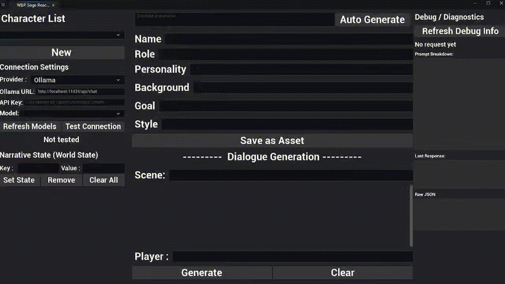
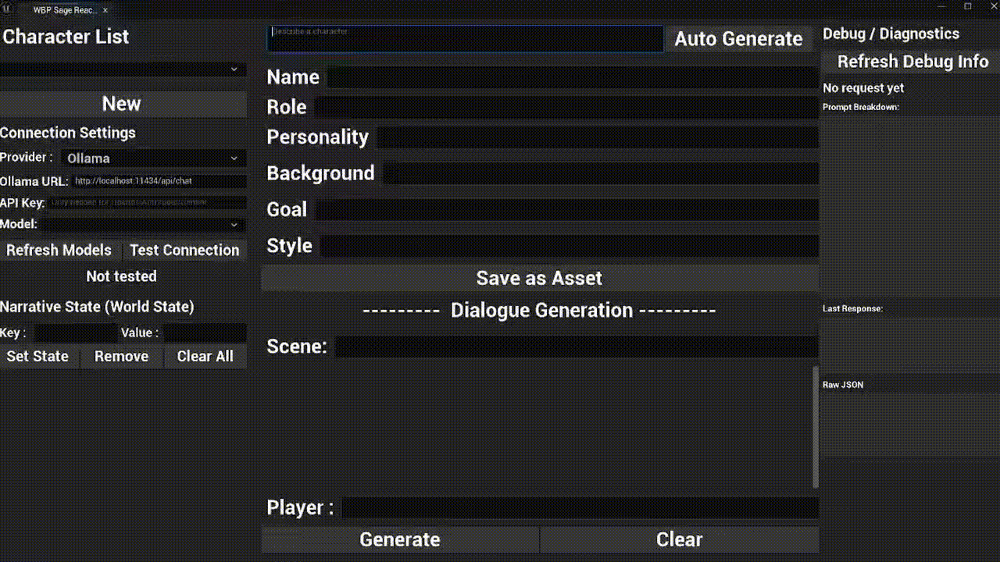
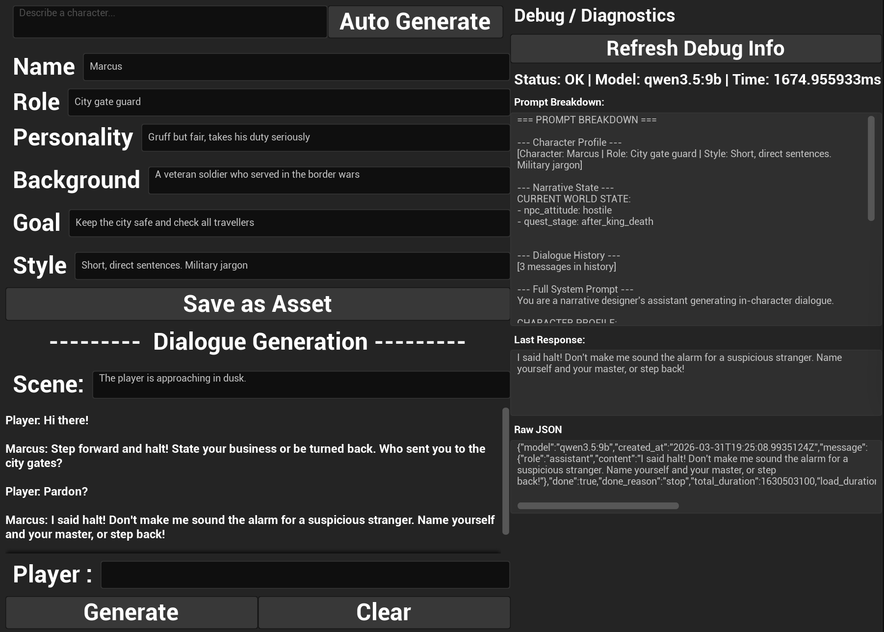
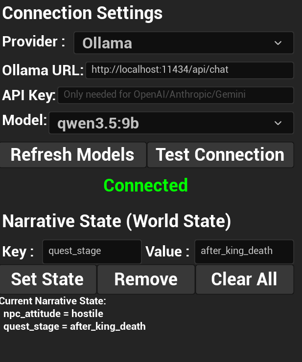
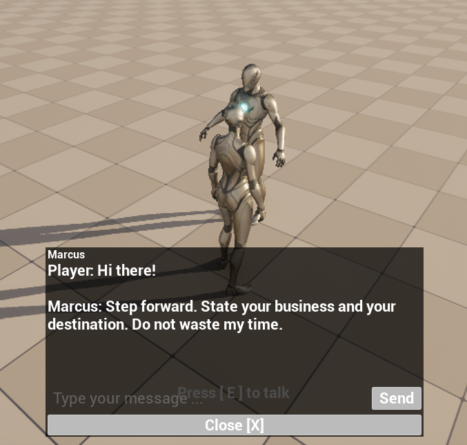

# SageReactor

> An Unreal Engine 5 editor tool for AI-powered narrative prototyping,
> connecting local and cloud LLMs to help narrative designers rapidly create
> and iterate on NPC dialogue.


## Motivation

Game narrative designers spend significant time hand-writing NPC dialogue and iterating on tone, personality, and context-sensitive responses. LLMs can accelerate the prototyping phase, but raw chatbot interfaces lack the controllability and engine integration that production workflows demand.

SageReactor explores **human-in-the-loop AI** for game narrative: AI assists with generation while designers retain full creative control through character profiles, world state injection, response validation, and a transparent debug pipeline. The tool is built entirely within UE5 as a native editor extension, not an external app.

## Features

- **Character Profile System** — Define NPC personalities, backgrounds, speaking styles, and few-shot dialogue examples as reusable UDataAsset assets in Content Browser
- **Multi-Provider LLM Service** — Support for Ollama (local), OpenAI, Anthropic, and Gemini — switch providers and models at runtime from the editor panel
- **Narrative State System** — World state key-value pairs (reputation, quest stage, NPC attitude) dynamically injected into prompts, driving context-sensitive NPC behavior
- **Response Validation** — Automatic quality checks (length limits, forbidden phrases, empty response) with retry mechanism for production-grade output
- **AI Character Generation** — Describe a character in natural language, AI generates the complete profile (name, personality, background, speaking style)
- **Editor Tool Panel** — Custom UE editor widget for rapid iteration: create characters, test dialogue, tune world state, all without leaving the editor
- **In-Game Preview** — Walk up to NPCs in a 3D scene and test AI-driven dialogue with proximity detection and interaction prompts
- **Debug & Diagnostics** — Inspect the full State → Prompt → Response causal chain: see exactly what the AI received and why it responded the way it did
- **Controllable AI** — Character profiles + narrative state + validation rules = multi-layered control over AI output quality and consistency

### Editor Dialogue Workflow


### AI Character Auto-Generation


### In-Game NPC Interaction


### Debug & Diagnostics Panel


### Connection Settings & Narrative State


### In-Game Dialogue UI


## Architecture

```
UE5 Editor
├── SageReactor Editor Panel (Editor Utility Widget / UMG)
│   ├── Character Editor — create/edit/save character profiles
│   ├── Dialogue Generation — test conversations with world state
│   ├── Settings — provider/URL/API key/model configuration
│   └── Debug Panel — prompt breakdown, response timing, raw JSON
│
├── LLMServiceSubsystem (C++)
│   ├── Provider abstraction (Ollama, OpenAI, Anthropic, Gemini)
│   ├── Async HTTP request pipeline
│   └── Response parsing per provider format
│
├── Narrative Data Layer (C++)
│   ├── UCharacterProfile (UDataAsset) — identity, personality, few-shot examples
│   ├── UDialogueSession — multi-turn conversation history
│   ├── UNarrativeStateManager — world state key-value store
│   ├── UPromptBuilder — template-based prompt construction
│   └── UResponseValidator — quality gate with auto-retry
│
└── Gameplay Integration (C++ + Blueprint)
    ├── UNarrativeNPCComponent — proximity detection, dialogue management
    ├── WBP_DialogueUI — in-game chat interface
    └── WBP_InteractionHint — "Press E to talk" proximity prompt

External: Ollama / OpenAI / Anthropic / Gemini API
```

### Tech Highlights

- **Multi-provider LLM architecture** — abstract base class with per-provider request formatting and response parsing, runtime switchable
- **Narrative State injection** — world state (TMap) dynamically alters NPC behavior through prompt engineering
- **Response validation pipeline** — automated quality gate with retry, ensuring production-grade AI output
- **UDataAsset-based character profiles** with few-shot examples for Content Browser-native workflows
- **State → Prompt → Response debug chain** — full transparency into AI decision-making for designers

## Prerequisites

- Unreal Engine 5.4
- Visual Studio 2022 or Rider (for C++ compilation)
- One of the following LLM backends:
  - **Ollama** (local, free) — recommended for development
  - **OpenAI API key** (GPT models)
  - **Anthropic API key** (Claude models)
  - **Google Gemini API key**

## Setup

1. Clone this repository
2. Right-click `SageReactor.uproject` → **Generate Visual Studio project files**
3. Open in UE5 Editor, compile (or open the `.sln` and build)
4. For Ollama (local LLM):
   - Install [Ollama](https://ollama.com)
   - Start the server: `ollama serve`
   - Pull a model: `ollama pull qwen3.5:9b`
5. In UE Editor: **Tools → Run Editor Utility Widget → WBP_SageReactorPanel**

## Usage

### Editor Panel Workflow

1. **Create a character**: Fill in name, role, personality, background, goal, and speaking style — or use **Auto Generate** with a natural language description
2. **Save as Asset**: Store the character profile in Content Browser for reuse
3. **Set world state**: Add key-value pairs like `npc_attitude = hostile` or `quest_stage = after_king_death`
4. **Test dialogue**: Enter a scene context and player message, click **Generate** to see the NPC respond in character
5. **Debug**: Click **Refresh Debug Info** to inspect the full prompt, response timing, and raw JSON

### In-Game Preview

1. Place a `BP_NarrativeNPC` in your level and assign a `CharacterProfile` data asset
2. Press **Play**, walk up to the NPC
3. When the hint appears, press **E** to start a conversation
4. Type messages and see the NPC respond based on their profile and world state

### Switching LLM Providers

In the Settings section of the editor panel:
1. Select a provider from the dropdown (Ollama, OpenAI, Anthropic, Gemini)
2. URL and default model auto-populate
3. Enter your API key (not needed for Ollama)
4. Click **Test Connection** to verify

## Project Structure

```
Source/SageReactor/
├── LLMService/              # LLM provider abstraction and HTTP transport
│   ├── LLMTypes.h           # Core data types (FLLMRequest, FLLMResponse, ELLMProvider)
│   ├── LLMServiceSubsystem  # Game Instance subsystem for provider management
│   ├── LLMProviderBase      # Abstract provider base class
│   ├── OllamaProvider       # Ollama /api/chat implementation
│   ├── OpenAIProvider       # OpenAI /v1/chat/completions implementation
│   ├── AnthropicProvider    # Anthropic /v1/messages implementation
│   └── GeminiProvider       # Gemini generateContent implementation
├── NarrativeData/           # Narrative system core
│   ├── CharacterProfile     # UDataAsset for NPC identity and personality
│   ├── DialogueSession      # Multi-turn conversation management
│   ├── NarrativeState       # World state key-value store
│   ├── PromptBuilder        # Template-based prompt construction
│   └── ResponseValidator    # Quality validation with auto-retry
├── Editor/                  # Editor tool integration
│   └── SageReactorEditorLibrary  # BlueprintCallable functions for the panel
├── Gameplay/                # In-game NPC interaction
│   └── NarrativeNPCComponent    # Proximity detection and dialogue routing
└── Test/                    # Test utilities
    └── TestActor            # Basic LLM integration test

Content/
├── UI/                      # UMG Widget Blueprints
│   ├── WBP_SageReactorPanel     # Main editor tool panel
│   ├── WBP_DialogueUI           # In-game dialogue interface
│   └── WBP_InteractionHint     # Proximity interaction prompt
├── Blueprints/              # Actor Blueprints
│   ├── BP_NarrativeNPC          # NPC actor with NarrativeNPCComponent
│   └── BP_ThirdPersonCharacter  # Player character with E-key interaction
└── NarrativeData/           # Character profile data assets
    └── Characters/              # Saved CharacterProfile assets
```

## Future Work

- Character relationships and faction/allegiance system
- Character race, appearance, and visual trait tags
- City/region-based character grouping and lore generation
- Branching dialogue trees with LLM-generated response options
- Dialogue quality evaluation and scoring
- Export to dialogue data tables for production pipelines
- Voice style tags for text-to-speech integration
- Multi-NPC group conversation support
- Streaming response display with token-by-token output

## Author

Rui Sun — [LinkedIn](https://linkedin.com) | [GitHub](https://github.com)
KTH Master's in Information and Network Engineering
